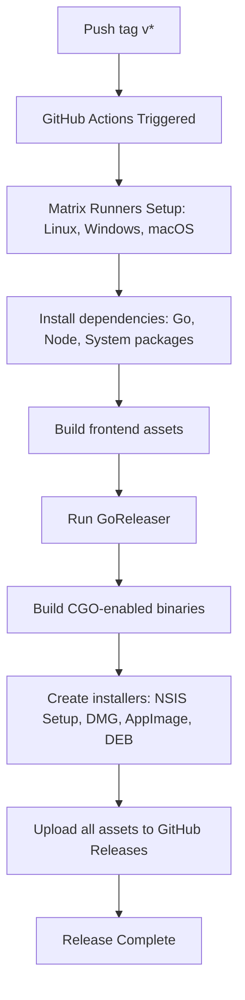

# Aura Music Release Process

This document outlines the step-by-step release process for building, packaging, and distributing new versions of Aura Music using GitHub Actions, GoReleaser, and GitHub Releases.

## 1. Prerequisites for Releases

Before generating a release, ensure:
* All code changes, visual refinements, and tests have been completed.
* The frontend static assets build is working (`npm run build` inside `frontend/`).
* Go dependencies are tidy (`go mod tidy`).
* The local Git workspace is clean.

## 2. Release Steps

Aura's release pipeline is completely automated upon pushing a version tag. Follow these steps to trigger a release:

### Step 1: Commit Changes
Ensure all preparation changes (e.g. updating documentation or release notes) are committed to `main`:
```bash
git add .
git commit -m "chore: prepare release v1.0.0"
git push origin main
```

### Step 2: Create a Version Tag
Create a semantic version tag prefixed with a `v` (e.g., `v1.0.0`, `v1.2.1-beta`):
```bash
git tag v1.0.0
```

### Step 3: Push the Tag to GitHub
Pushing the tag triggers the CI/CD release workflow:
```bash
git push origin v1.0.0
```

---

## 3. GitHub Actions CI/CD Pipeline

Once the tag is pushed, the workflow defined in `.github/workflows/release.yml` starts:



### Build Matrix Artifacts Generated:
* **Windows**: `Aura-Setup-Windows-x64.exe` & `Aura-Setup-Windows-arm64.exe`
* **macOS**: `Aura-macOS-amd64.dmg` & `Aura-macOS-arm64.dmg`
* **Linux**: `Aura-Linux-x64.AppImage`, `Aura-Linux-arm64.AppImage`, `Aura-Linux-x64.deb`, `Aura-Linux-arm64.deb`
* **Hashes**: `checksums.txt` (SHA-256 validation file)

---

## 4. Release Channel Rules
* **Stable Channel**: Initiated by pushing tags matching `v*.*.*` (e.g. `v1.0.0`).
* **Beta Channel**: Initiated by pushing tags matching pre-release tags (e.g. `v1.0.1-beta.0`). The updater service parses the channel and latest tag to suggest appropriate releases.
